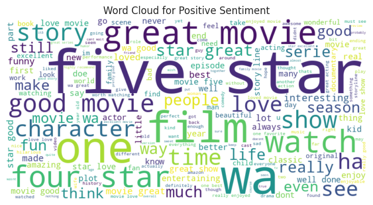
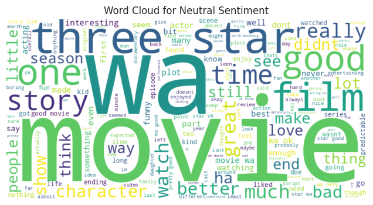
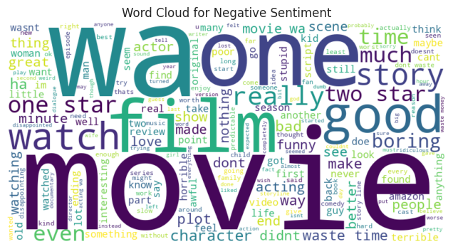
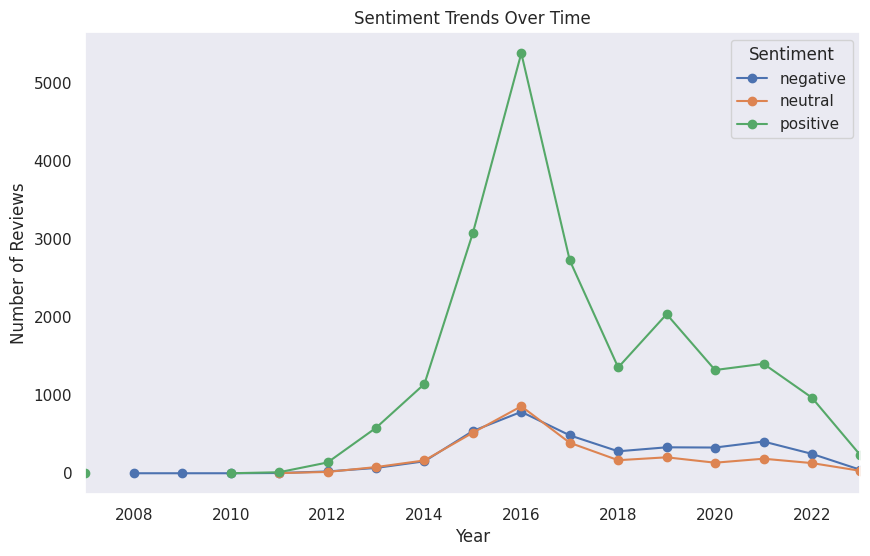

# An Amazon Prime Video Sentiment Analysis

## Table of Contents
- [An Amazon Prime Video Sentiment Analysis](#an-amazon-prime-video-sentiment-analysis)
  - [Table of Contents](#table-of-contents)
  - [About The Project](#about-the-project)
    - [Overview](#overview)
    - [Problem Statement](#problem-statement)
    - [Business Objectives](#business-objectives)
  - [Built With](#built-with)
  - [Getting Started](#getting-started)
    - [Prerequisites](#prerequisites)
    - [Installation](#installation)
    - [Usage](#usage)
  - [Dataset Information](#dataset-information)
    - [Data Source](#data-source)
    - [Dataset Details](#dataset-details)
    - [Key Features](#key-features)
    - [Preprocessing Steps](#preprocessing-steps)
  - [Methodology](#methodology)
    - [Baseline Models](#baseline-models)
    - [Advanced Models](#advanced-models)
    - [Target Variable](#target-variable)
    - [Evaluation Metrics](#evaluation-metrics)
  - [Results \& Insights](#results--insights)
- [Model Training \& Evaluation](#model-training--evaluation)
  - [Dataset Splitting](#dataset-splitting)
  - [Baseline Models](#baseline-models-1)
  - [Naïve Bayes Results](#naïve-bayes-results)
    - [Class Performance:](#class-performance)
    - [Strengths:](#strengths)
    - [Weaknesses:](#weaknesses)
- [Baseline SVM Model (3.2.2)](#baseline-svm-model-322)
  - [Overview](#overview-1)
  - [Model Performance](#model-performance)
    - [*Overall Accuracy: 87%*](#overall-accuracy-87)
    - [*Class-Wise Performance*](#class-wise-performance)
    - [*Key Observations*](#key-observations)
  - [*Recommendations for Improvement*](#recommendations-for-improvement)
- [Random Forest Baseline Model](#random-forest-baseline-model)
  - [Overview](#overview-2)
  - [Model Performance](#model-performance-1)
    - [*Overall Accuracy: 86%*](#overall-accuracy-86)
    - [*Class-Wise Performance*](#class-wise-performance-1)
    - [*Key Observations*](#key-observations-1)
    - [*Challenges*](#challenges)
- [*Comparison of Baseline Models \& Way Forward*](#comparison-of-baseline-models--way-forward)
  - [*Overall Accuracy*](#overall-accuracy)
  - [*Negative Sentiment Performance*](#negative-sentiment-performance)
  - [*Neutral Sentiment Performance*](#neutral-sentiment-performance)
  - [*Positive Sentiment Performance*](#positive-sentiment-performance)
  - [*Weighted Average Metrics*](#weighted-average-metrics)
  - [*Conclusion \& Next Steps*](#conclusion--next-steps)
- [📌 *Hyperparameter-Tuned SVM Model*](#-hyperparameter-tuned-svm-model)
      - [🔍 *Objective*](#-objective)
      - [⚙ *Best Parameters Identified*](#-best-parameters-identified)
      - [📊 *Performance Metrics*](#-performance-metrics)
      - [📈 *Key Observations*](#-key-observations)
      - [🛠 *Next Steps*](#-next-steps)
    - [*Hyperparameter Tuned SVM Model with Undersampling*](#hyperparameter-tuned-svm-model-with-undersampling)
      - [*Objective:*](#objective)
    - [*1. Initial Hyperparameter Tuning (Before Undersampling)*](#1-initial-hyperparameter-tuning-before-undersampling)
      - [*Performance (Before Undersampling):*](#performance-before-undersampling)
    - [*2. Undersampling the Positive Class*](#2-undersampling-the-positive-class)
    - [*3. Performance After Undersampling*](#3-performance-after-undersampling)
    - [*4. Conclusion*](#4-conclusion)
    - [Recommendation](#recommendation)
    - [Next Step](#next-step)
  - [Deployment Plan](#deployment-plan)
    - [Deliverables](#deliverables)
    - [Web App (Stretch Goal)](#web-app-stretch-goal)
    - [API (Stretch Goal)](#api-stretch-goal)
  - [Tools \& Technologies Used](#tools--technologies-used)
    - [Libraries](#libraries)
  - [How to Run the Project](#how-to-run-the-project)
    - [Run Baseline Models](#run-baseline-models)
    - [Run Advanced Model(BERT)](#run-advanced-modelbert)
    - [Run Web App (if implemented)](#run-web-app-if-implemented)
  - [Future Enhancements](#future-enhancements)
  - [Contributors](#contributors)
  - [Contact](#contact)
  - [Acknowledgments](#acknowledgments)

## About The Project
### Overview
This project aims to analyze Amazon Prime Video ratings and reviews to understand customer sentiment, identify trends in viewer preferences, and determine factors influencing high or low ratings. The insights will help improve recommendations, optimize content offerings, and enhance user satisfaction.

### Problem Statement
In the highly competitive streaming industry, Amazon Prime Video must continuously enhance customer satisfaction and engagement to stay ahead of competitors like Netflix and Disney+. Key challenges include:

  *- Addressing Negative Sentiments:* Understanding recurring complaints about content quality, technical issues, and pricing concerns to improve user satisfaction.

  *-Differentiating Neutral Sentiment:* Analyzing neutral reviews to uncover hidden dissatisfaction or lukewarm reception.

  *-Improving Content Strategy:* Identifying trends in user feedback related to genres, storylines, production quality, and casting choices.

  *-Actionable Business Insights:* Utilizing sentiment analysis beyond classification to refine marketing, pricing models, and recommendation algorithms.

By leveraging *NLP* techniques and machine learning, this project aims to extract meaningful insights from customer reviews to enhance Prime Video's content strategy and user experience.

### Business Objectives  

1. *Understand Sentiment by Genre* – Analyze audience emotions across different content genres to identify trends in user engagement and satisfaction.  

2. *Improving Customer Retention* – Identify key drivers of positive sentiment (e.g., genre, cast, production quality) to enhance viewer loyalty and reduce churn.  

3. *Enhancing Product Offerings* – Use negative sentiment analysis to pinpoint recurring content or technical issues, ensuring proactive improvements to meet customer expectations.  

4. *Refine Content and Service Differentiation* – Analyze neutral reviews to uncover areas for incremental improvements, preventing stagnation and transforming average user experiences into positive ones.

## Built With
- *Programming Language:* Python
- *Libraries:* pandas, numpy, nltk, sklearn, seaborn, matplotlib, wordcloud, spacy, transformers, torch
- *Development Environment:* Google Colab, Local Machine

## Getting Started
### Prerequisites
Before running this project, ensure you have:
- Python 3.8+
- Jupyter Notebook or Google Colab
- Required Python libraries installed:
  bash
  pip install pandas numpy matplotlib seaborn nltk spacy transformers torch scikit-learn
  

### Installation
1. Clone the repository:
   sh
   git clone https://github.com/your-repo/sentiment-analysis.git
   
2. Navigate to the project directory:
   sh
   #cd sentiment-analysis
   
3. Install dependencies:
   sh
   #pip install -r requirements.txt
   

### Usage
- Run the Jupyter Notebook or Google Colab file to explore the dataset and train models.
- Modify parameters and experiment with different models.
- Save trained models using joblib for deployment.

## Dataset Information
### Data Source
The dataset is sourced from [McAuley Lab’s Amazon Reviews Dataset (2023)](https://amazon-reviews-2023.github.io/). It includes:
- User Reviews: Ratings, text, helpfulness votes
- Item Metadata: Descriptions, price, category, images
- Links: User-item relations

### Dataset Details
- Extracted 233,000 Amazon Prime Video reviews
- Merged User Reviews and Item Metadata using parent_asin
- Filtered out non-Prime Video reviews

### Key Features
- *Review Text* – User-written review content
- *Star Rating* – Numeric rating (1-5)
- *Timestamp* – Review date/time
- *Product Metadata* – Movie/TV title, genre, release year
- *User Metadata* – Verified purchase status, review count## Visualization Strategy 
- *Word Clouds* – Common themes in positive neutral & negative reviews

- *Bar Charts & Histograms* – Rating distributions, sentiment trends

- *Time-Series Analysis* – Sentiment shifts over time

### Preprocessing Steps
- Handling missing values & duplicates
- Removing stopwords, special characters, punctuation
- Tokenization, lemmatization, vectorization (TF-IDF, embeddings)
- Addressing class imbalance in sentiment labels

## Methodology
### Baseline Models
- Multinomial Naïve Bayes (NB) – Fast and efficient for text classification
- Support Vector Machines (SVM) – Handles high-dimensional text data

### Advanced Models
- LSTM & BiLSTM (RNNs) – Captures sequential text dependencies
- BERT Transformers – State-of-the-art NLP model for contextual understanding

### Target Variable
- Sentiment Classification:
  - Positive (4-5 stars)
  - Neutral (3 stars)
  - Negative (1-2 stars)

### Evaluation Metrics
- *Accuracy* – Overall model correctness
- *Precision, Recall, F1-Score* – Performance across sentiment classes
- *Confusion Matrix* – Misclassification visualization

## Results & Insights
- Sentiment trends over time
- Most frequent keywords in positive vs. negative reviews
- Correlation between genre and sentiment
- Effectiveness of traditional ML vs. deep learning models

# Model Training & Evaluation

## Dataset Splitting

The dataset was stratified to maintain class distribution.

*Split Ratios:*
- *60%* for training (*16,190* samples)
- *20%* for validation (*5,397* samples)
- *20%* for testing (*5,397* samples)

Ensured reproducibility with random_state=42.

## Baseline Models

Three models were trained using *TF-IDF vectorization*:
- *Multinomial Naïve Bayes (NB)*
- *Support Vector Machine (SVM)*
- *Random Forest (RF)*

## Naïve Bayes Results

*Accuracy:* *86%*  

### Class Performance:
- *Positive Sentiment:* Best performance with *87% precision* and *99% recall*.
- *Negative Sentiment:* Lower recall (*61%*), meaning many negative reviews were misclassified.
- *Neutral Sentiment:* Weak recall (*28%*), showing difficulty in distinguishing neutral reviews.

### Strengths:
- Fast training
- High precision for positive reviews

### Weaknesses:
- Struggles with neutral/negative classification.

# Baseline SVM Model (3.2.2)

## Overview
- *Class Weight Handling:* class_weight='balanced' compensates for class imbalance.
- *Feature Extraction:* TF-IDF vectorization with *5,000 max features* and *1-3 n-grams*.
- *Model Used:* Support Vector Machine (*SVC*).

## Model Performance

### *Overall Accuracy: 87%*
- *Strong performance for positive sentiment* (Recall: *95%*).
- *Moderate performance for negative sentiment* (Recall: *74%*).
- *Struggles with neutral sentiment* (Recall: *53%*).

### *Class-Wise Performance*
| Sentiment | Precision | Recall | F1-Score | Support |
|-----------|----------|--------|----------|---------|
| Negative  | 0.75     | 0.74   | 0.74     | 743     |
| Neutral   | 0.63     | 0.53   | 0.57     | 579     |
| Positive  | 0.93     | 0.95   | 0.94     | 4075    |
| *Macro Avg* | *0.77* | *0.74* | *0.75* | *5397* |
| *Weighted Avg* | *0.87* | *0.87* | *0.87* | *5397* |

### *Key Observations*
- *Positive Class:* *High accuracy* with *3,864 correct predictions*.
- *Negative Class:* *551 correctly classified, but **139 misclassified as positive*, which could affect interpretation.
- *Neutral Class:* *High confusion, with **many samples misclassified as positive (178) or negative (83)*.

## *Recommendations for Improvement*
1. *Use an ensemble model* (e.g., *Random Forest*) for better generalization.
2. *Hyperparameter tuning*, adjusting:
   - Kernel type (*linear, rbf*).
   - Regularization parameters (*C, gamma*).
3. *Undersample the majority class* to balance the dataset.

#  Random Forest Baseline Model

## Overview
- *Class Weight Handling:* class_weight='balanced' ensures the minority class is not ignored.
- *Feature Extraction:* TF-IDF vectorization with *5,000 max features* and *1-3 n-grams*.
- *Model Used:* Random Forest (*RF*).

## Model Performance

### *Overall Accuracy: 86%*
- *Strong performance for positive sentiment* (Recall: *99%*).
- *Weak performance for neutral sentiment* (Recall: *34%*).
- *Moderate performance for negative sentiment* (Recall: *57%*).

### *Class-Wise Performance*
| Sentiment | Precision | Recall | F1-Score | Support |
|-----------|----------|--------|----------|---------|
| Negative  | 0.84     | 0.57   | 0.68     | 743     |
| Neutral   | 0.83     | 0.34   | 0.48     | 579     |
| Positive  | 0.86     | 0.99   | 0.92     | 4075    |
| *Macro Avg* | *0.85* | *0.63* | *0.69* | *5397* |
| *Weighted Avg* | *0.86* | *0.86* | *0.84* | *5397* |

### *Key Observations*
- *Positive Class:* 
  - *4037 out of 4075* correctly classified (*99% recall*).
  - *Few misclassifications: **33 as negative, 23 as neutral*.
- *Negative Class:* 
  - *Moderate recall (57%), with **296 misclassified as positive*.
  - *19 samples misclassified as neutral*.
- *Neutral Class:* 
  - *Significant confusion, with **335 neutral samples misclassified as positive*.
  - *45 neutral samples misclassified as negative*.
  - *Low recall (34%)*, showing difficulty in distinguishing neutral sentiments.

### *Challenges*
- *Clear bias toward the positive class, leading to frequent **misclassification of minority classes*.
- *Low recall and F1 scores for neutral and negative sentiments*, indicating difficulty in distinguishing them correctly.

# *Comparison of Baseline Models & Way Forward*

## *Overall Accuracy*
- *Naive Bayes*: 86.2%  
- *Random Forest*: 86.1%  
- *SVM: **87.4%* (highest)  

SVM achieves the highest accuracy but accuracy alone isn't sufficient due to class imbalance.  

## *Negative Sentiment Performance*
- *Precision: Random Forest (0.85*) > Naive Bayes (0.81) > SVM (0.75)  
- *Recall: SVM (0.74*) > Naive Bayes (0.61) > Random Forest (0.58)  
- *F1-Score: SVM (0.74*) > Naive Bayes (0.70) = Random Forest (0.70)  

SVM performs best in terms of F1-score, balancing precision and recall, while Random Forest has the highest precision (fewer false positives).  

## *Neutral Sentiment Performance*
- *Precision: Naive Bayes (0.90*) > Random Forest (0.83) > SVM (0.63)  
- *Recall: SVM (0.53*) > Random Forest (0.34) > Naive Bayes (0.28)  
- *F1-Score: SVM (0.57*) > Random Forest (0.49) > Naive Bayes (0.43)  

SVM outperforms in recall and F1-score, meaning it correctly identifies more neutral instances. However, all models struggle with neutral classification.  

## *Positive Sentiment Performance*
- *Precision: Naive Bayes & SVM (0.87*) > Random Forest (0.86)  
- *Recall: Naive Bayes & Random Forest (0.99*) > SVM (0.95)  
- *F1-Score: Naive Bayes (0.95*) > SVM (0.94) > Random Forest (0.92)  

All models perform well on positive sentiment, with Naive Bayes slightly ahead in F1-score.  

## *Weighted Average Metrics*
- *Precision: SVM (0.87*) > Naive Bayes (0.86) = Random Forest (0.86)  
- *Recall: SVM (0.87*) > Naive Bayes (0.86) = Random Forest (0.86)  
- *F1-Score: SVM (0.87*) > Naive Bayes (0.84) = Random Forest (0.84)  

SVM consistently outperforms in weighted averages, making it the best model overall.  

## *Conclusion & Next Steps*
✅ *Best Model Overall: **SVM* (highest accuracy, weighted metrics, and strong positive sentiment performance).  
⚠ *Key Weakness*: All models struggle with neutral sentiment classification.  
📌 *Next Steps*:  
- *Tune SVM hyperparameters* to improve recall on neutral and negative classes.  
- *Explore class rebalancing techniques* (oversampling, synthetic data, or class weighting).  
- *Feature engineering & alternative models* (e.g., deep learning) for better performance.  

# 📌 *Hyperparameter-Tuned SVM Model*  

#### 🔍 *Objective*  
- Optimize class separation and address bias toward the positive class using *GridSearchCV*.  
- Focus on improving *macro-averaged recall* using the best parameters identified in a prior tuning step.  

#### ⚙ *Best Parameters Identified*  
python
{'svm__C': 10, 'svm__class_weight': 'balanced', 'svm__gamma': 0.01, 'svm__kernel': 'rbf'}

- *C = 10*: Stronger regularization to prevent overfitting.  
- *Kernel = RBF*: Captures non-linear decision boundaries.  
- *Gamma = 0.01*: Controls the influence of individual training samples.  
- *Class Weight = Balanced*: Adjusts for class imbalance.  

#### 📊 *Performance Metrics*  

| Class      | Precision | Recall | F1-Score | Support |
|------------|------------|------------|------------|------------|
| *Negative* | 0.64 | 0.82 | 0.72 | 743 |
| *Neutral*  | 0.43 | 0.67 | 0.53 | 579 |
| *Positive* | 0.97 | 0.84 | 0.90 | 4075 |
| *Overall Accuracy* | *0.82* | - | - | *5397* |
| *Macro Avg* | *0.68* | *0.78* | *0.71* | - |
| *Weighted Avg* | *0.86* | *0.82* | *0.83* | - |

#### 📈 *Key Observations*  
✅ *Negative Class:*  
- *Recall (0.81)* improved significantly, meaning the model correctly identifies more negative samples.  
- *Moderate Precision (0.64)* suggests some misclassifications.  

⚠ *Neutral Class (Needs Improvement):*  
- *Precision (0.43)* is low, meaning many neutral predictions are incorrect.  
- *Recall (0.67)* is improved, but still requires further tuning.  

🚀 *Positive Class (Strong Performance):*  
- *Precision (0.97)* and *F1-Score (0.90)* are excellent.  
- *Recall (0.84)* is strong but can be improved slightly.  

#### 🛠 *Next Steps*  
- *Undersample the Positive Class* to achieve better balance.  
- *Retain the Best Parameters* while fine-tuning for better neutral class precision.  

🔹 *The fine-tuned SVM model demonstrates solid improvements, especially in recall for the negative and neutral classes. The next iteration will focus on class balance adjustments to further refine performance.* 🎯

### *Hyperparameter Tuned SVM Model with Undersampling*  

#### *Objective:*  
To optimize class separation and address bias toward the positive class by using GridSearchCV for hyperparameter tuning and undersampling the dominant class (positive) to improve balance.

---

### *1. Initial Hyperparameter Tuning (Before Undersampling)*  
Using *GridSearchCV, the best parameters for the **SVM model* were identified:  
- *C* = 10  
- *Kernel* = rbf  
- *Gamma* = 0.01  
- *Class Weight* = balanced  

#### *Performance (Before Undersampling):*  
- *Accuracy:* 82%  
- *Macro Average Recall:* 78%  
- *Positive Class:*  
  - Precision: 0.97, Recall: 0.84, F1-Score: 0.90  
- *Neutral Class:*  
  - Precision: 0.43, Recall: 0.67, F1-Score: 0.53  
- *Negative Class:*  
  - Precision: 0.63, Recall: 0.81, F1-Score: 0.71  

🔹 The *neutral class* had the lowest precision and recall, requiring further optimization.  

---

### *2. Undersampling the Positive Class*  
To mitigate class imbalance, the *positive class* was undersampled to *4,000 samples*, making class sizes more balanced:  

| Sentiment Class | Before Undersampling | After Undersampling |
|---------------|-------------------|------------------|
| Negative      | 3,715             | 3,715            |
| Neutral      | 2,894             | 2,894            |
| Positive      | 20,375            | 4,000            |

---

### *3. Performance After Undersampling*  
- *Accuracy:* 82% (unchanged)  
- *Macro Average Recall:* *83%* (↑ improved from 78%)  
- *Positive Class:*  
  - Precision: *0.98* (↑), Recall: *0.82* (↓), F1-Score: *0.89* (↓)  
- *Neutral Class:*  
  - Precision: *0.46* (↑), Recall: *0.79* (↑), F1-Score: *0.58* (↑)  
- *Negative Class:*  
  - Precision: *0.64* (↑), Recall: *0.87* (↑), F1-Score: *0.74* (↑)  

🔹 *Key Improvements:*  
✅ *Neutral class recall improved significantly* (0.67 → 0.79)  
✅ *Negative class recall improved* (0.81 → 0.87)  
✅ *Overall balance improved across all classes*  

⚠ *Trade-off:* Slight drop in recall for the *positive class* (0.84 → 0.82), but improved fairness across all categories.

---

### *4. Conclusion*  
- *Undersampling helped improve model balance, reducing bias towards the positive class.*  
- *Neutral and negative class performance significantly improved.*  
- *Future Improvements:* Consider experimenting with *SMOTE (Synthetic Minority Over-sampling Technique)* to generate synthetic neutral and negative samples for even better performance.  

🚀 *Final Model: SVM Pipeline*  
python
Pipeline(steps=[
    ('tfidf', TfidfVectorizer(max_features=5000, ngram_range=(1, 3))),
    ('svm', SVC(C=10, class_weight='balanced', gamma=0.01, random_state=42))
])

### Recommendation

1. *Deep Dive into Sentiment Distribution*  
   - Segment neutral and negative feedback into themes (e.g., content quality, technical issues, genre preferences).  
   - Identify recurring pain points and prioritize critical areas for improvement.  
   - Implement targeted solutions such as enhancing storytelling, upgrading streaming technology, and expanding diverse content.  
   - Use positive sentiment for marketing and ensure ongoing feedback collection to measure improvements.  

2. *Address Sentiment by Genre*  
   - *Leverage Popular Genres* – Promote highly rated genres (e.g., Animation, Fantasy) through targeted recommendations and exclusive content investments.  
   - *Address Critical Feedback* – Improve underperforming genres (e.g., Horror, Arts) by addressing viewer concerns, collaborating with experienced creators, and piloting innovative content formats.  
   - *Refine Neutral Sentiment Categories* – Analyze the reasons behind neutral feedback, tailor content strategies for better audience engagement, and measure the impact of new initiatives.

### Next Step  

1. *Model Deployment*  
   - Develop a *Flask-based API* to process user inputs and return sentiment results efficiently.  
   - Ensure *scalability* through containerization (Docker) and cloud deployment (AWS/Azure).  
   - Secure the API with *authentication and encryption* measures.  

2. *User Interface (UI)*  
   - Create a *user-friendly interface* for sentiment analysis interaction.  
   - Provide *real-time feedback* and sentiment trend visualizations.  
   - Ensure *cross-device accessibility* (desktop, tablet, mobile).  

3. *Advanced Modeling Techniques*  
   - Implement *LSTMs, BERT, or GPT* for more accurate and real-time sentiment classification.  
   - Conduct *Aspect-Based Sentiment Analysis* to identify feedback on specific elements (e.g., content, streaming quality).  
   - Extend *Emotion Detection* beyond sentiment to classify emotions like joy, frustration, and anger.  
   - Introduce *Personalized Recommendations* based on user sentiment and preferences.

## Deployment Plan
### Deliverables
- Jupyter Notebook with EDA, modeling, and evaluation
- PowerPoint summary of key insights

### Web App (Stretch Goal)
- Built using Flask, Streamlit, or Dash
- Interactive visualization of sentiment trends
- Review-based sentiment analysis

### API (Stretch Goal)
- Flask API for sentiment prediction
- Accepts user reviews and returns sentiment label

## Tools & Technologies Used
### Libraries
- *Data Processing*: pandas, numpy
- *Visualization*: matplotlib, seaborn, wordcloud
- *NLP & Feature Engineering*: NLTK, spaCy, TF-IDF, Word2Vec
- *Machine Learning*: scikit-learn (NB, SVM), XGBoost, Random Forest
- *Deep Learning*: TensorFlow, Keras, transformers (Hugging Face BERT)

## How to Run the Project
### Run Baseline Models
python
python svm_model.py

### Run Advanced Model(BERT)
python
python bert_model.py

### Run Web App (if implemented)
bash
streamlit run app.py

## Future Enhancements
✅ Optimize hyperparameters for ML & DL models  
✅ Implement real-time sentiment analysis API  
✅ Integrate with IMDb or external sources for richer data  
✅ Build a recommendation system based on sentiment trends  

## Contributors
- *Team Members:* (List names)
- *Mentor:* (If applicable)
- *Contact:* (GitHub repo)

## Contact
- Your Name - Group 1 Capstone project
- Project Link: [GitHub Repository](https://github.com/WambuiMunene/Group_1_Capstone_Project)

## Acknowledgments
- Open-source datasets from Amazon Prime
- Python community for excellent libraries
- Online NLP and ML courses for guidance
